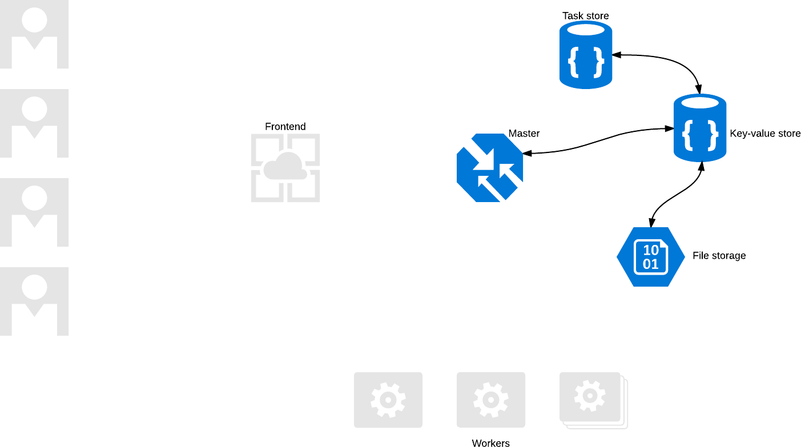
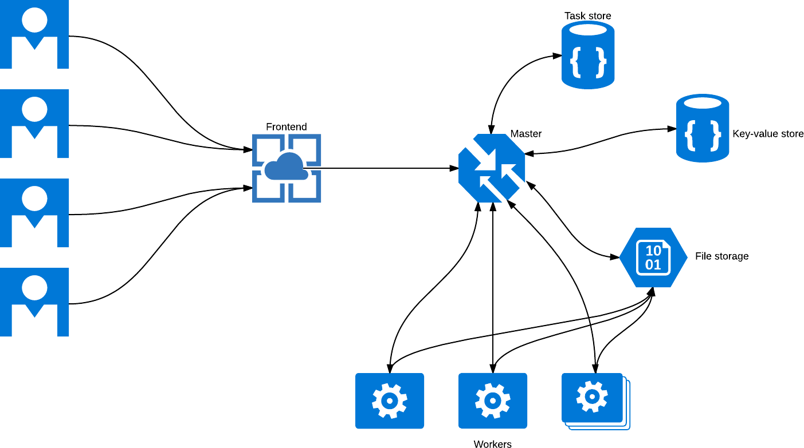
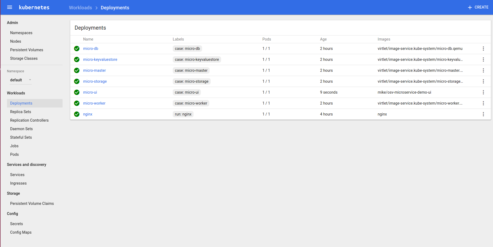
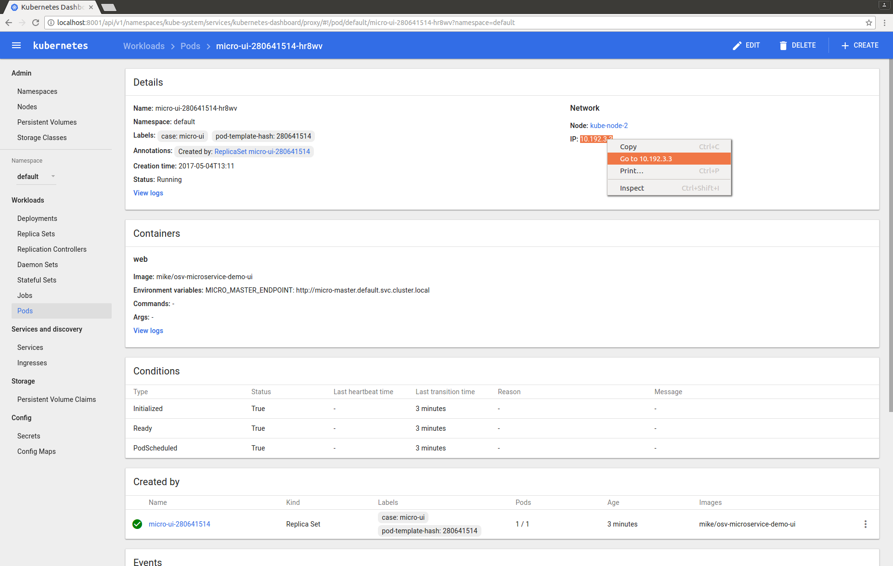
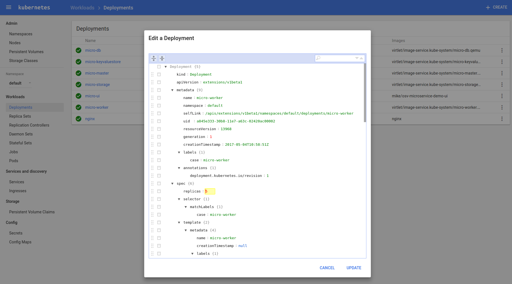

# Running Microservices in OSv

This repository serves demonstration purposes of the improvements made to [OSv](https://github.com/cloudius-systems/osv) and [Capstan](https://github.com/mikelangelo-project/capstan) in the [MIKELANGELO project](http://mikelangelo-project.eu). OSv is a operating system designed specifically for lightweight cloud workloads. It's been developed initially by Cloudius Systems, now ScyllaDB. Capstan is a tool for rapidly composing applications into self-contained virtual machines ready to be deployed to various virtual machine monitors.

The design for this demo is based on a [tutorial](https://jacobmartins.com/2016/03/14/web-app-using-microservices-in-go-part-1-design/) written by [Jacob Martin](https://twitter.com/cube2222_2). The microservices are implemented in JavaScript using Node.js runtime.

## Application Services

The application consists of five specialised microservices, each responsible for its own task. The application allows users to upload photos, which are processes using a static image filter and stored for users to download them after being processed. The RESTful API is intentionally kept at a minimum.

These services are

* `keyvaluestore.js`: a central key-value store which is used by other services to register themselves and to query information about other services in the deployed system
* `db.js`: a simple database service storing information about the tasks to be handled by the workers
* `storage.js`: file storage used to save images to be processed by the system
* `master.js`: master service through which most of the other services operate
* `worker.js`: executor who is processing pending tasks by acquiring the image from the storage, transforming it and saving it back to the storage

## Application Workflow

The workflow consists of two phases. During the first phase, the microservices are registered in the key-value storage. Each service will register its access point (e.g. `http://hostname:port`) from where other services will be able to look it up.



Once the services are registered, the application can be used. The collaboration between the services is depicted in the following diagram. This diagram introduces a frontend which is not part of this repository (it could be a web app using the backend API or just a simple curl).



## Using the Application

Before you can use the application, ensure you have Node.js installed (version 4.4.5 was used for this tutorial). Navigate to the root directory of this project and install required packages

```
$ npm install
```

This will download and install required packages inside `node_modules` subdirectory. You should now be able to launch individual services. Start with the central key-value store:

```
$ node keyvaluestore.js
server is listening on 8000
```

In separate terminals launch remaining services:

```
$ node db.js localhost:8000
Database endpoint registered
Database is listening on 8001
```

```
$ node storage.js localhost:8000
Storage endpoint registered
Storage is listening on 8002
```

```
$ node master.js localhost:8000
Master endpoint registered
Master is listening on 8003
```

If done correctly, the key-value store should provide information about registered servives, e.g.:

```
dbendpoint=127.0.1.1:8001
storageendpoint=127.0.1.1:8002
masterendpoint=127.0.1.1:8003
```

If not, open an issue :-).

Now try and upload one photo using the master node (check the above diagram to understand why we are uploading photos to the master service).

```
$ curl -X POST -F "image=@/path/to/photo.png" http://$MASTER_ENDPOINT/task
```

Now launch the worker:

```
$ node worker.js localhost:8000
Working on task 2
        processing /home/lemmy/dev/mpm/node-micri/worker/2.png
        done
Nothing to do at the moment
```

To upload more photos at the same time, you can use the accompanied script `bin/upload_batch.sh`:

```
$ ./bin/upload_batch.sh localhost:8000 /home/lemmy/dl/IMG_0995.PNG 20
```

This will
* query the key-value store at `localhost:8000` to get the endpoint of the master
* upload the phoot at given path `/home/lemmy/dl/IMG_0995.PNG` 20 times

Now start your worker again

```
$ node worker.js localhost:8000
Working on task 3
        processing /home/lemmy/dev/mpm/node-micri/worker/3.png
        done
Working on task 4
        processing /home/lemmy/dev/mpm/node-micri/worker/4.png
        done
Working on task 5
        processing /home/lemmy/dev/mpm/node-micri/worker/5.png
        done
Working on task 6
...
```

You can start as many workers are necessary. In case a task is not finished by a certain timeout, another worker will try to process it again. This allows you to stop the workers without fearing to loose or miss a task. Feel free to upload new and new photos to the app.

## Here Come Unikernels

This project already contains Capstan package descriptor. Before you can use it, you should follow [these instructions](https://github.com/mikelangelo-project/capstan/blob/master/Documentation/Installation.md) to get `capstan` tool.

The package manifest is described in `meta/package.yaml` file:

```
name: node-micro
title: Node Microservices
author: lemmy
require:
- eu.mikelangelo-project.app.node-4.4.5
```

`name`, `title` and `author` are used by Capstan mainly for displaying this information at various places. The `require` lists all packages that need to be collected while composing target unikernel (target VM comprised of bootloader, OSv kerenel and your application). To get a list of packages available for download, use `capstan package search` command. When looking for a specific package, add the name, for example

```
$ capstan package search node
Name                                               Description                                        Version                   Created
eu.mikelangelo-project.app.hello-node              NodeJS-4.4.5                                       4.4.5                     0001-01-01T00:00:00Z
eu.mikelangelo-project.app.node-4.2.6              NodeJS                                             v0.24-300-g33e3a36        0001-01-01T00:00:00Z
eu.mikelangelo-project.app.node-4.4.5              NodeJS-4.4.5                                       4.4.5                     0001-01-01T00:00:00Z
```

Then just add the package name to the list of required packages. For example, if you'd like to add the CLI (Command Line Interface, a simple _shell_ in OSv), add `eu.mikelangelo-project.osv.cli` to the list of required packages (to get the full name, we used `capstan package search cli`).

Now that we have the basics covered (feel free to read through the documentation of [Capstan project](https://github.com/mikelangelo-project/capstan/tree/master/Documentation)) we can continue preparing the unikernel. Let's compose the virtual machine image:

```
$ capstan package compose node-micro/tutorial
Empty command line will be set for this image
Importing node-micro/tutorial...
Importing into /home/lemmy/.capstan/repository/node-micro/tutorial/tutorial.qemu
Uploading files to /home/lemmy/.capstan/repository/node-micro/tutorial/tutorial.qemu...
Setting cmdline: --norandom --nomount --noinit /tools/mkfs.so; /tools/cpiod.so --prefix /zfs/zfs; /zfs.so set compression=off osv
Uploading files 3016 / 3016 [=========================================================] 100.00 % 4s
All files uploaded
Command line set to: ''
```

That's it. You now have a complete Node.js application ready to be executed inside lightweight virtual machine based on OSv. Check this out:

```
$ qemu-img info /home/lemmy/.capstan/repository/node-micro/tutorial/tutorial.qemu
image: /home/lemmy/.capstan/repository/node-micro/tutorial/tutorial.qemu
file format: qcow2
virtual size: 10G (10737418240 bytes)
disk size: 33M
cluster_size: 65536
Format specific information:
    compat: 1.1
    lazy refcounts: false
    refcount bits: 16
    corrupt: false
```

Notice the `disk size`? That's all it takes to host a self-contained Node.js app inside OSv.

The Capstan tool is used to launch individual unikernels. The simplest way to start this image is to use the following command:

```
$ capstan run -e "/node keyvaluestore.js" node-micro/tutorial
Created instance: node-micro-tutorial
Setting cmdline: /node keyvaluestore.js
OSv v0.24-300-g33e3a36
eth0: 192.168.122.15
server is listening on 8000
```

This will use default values for various configuration options, launch a VM using QEMU/KVM hypervisor and start the application.

To be more useful in a local environment, we are going to use the following command:

```
$ sudo ~/dev/bin/capstan run -m 200M -c 1 -n vhost --mac="A2:13:15:00:80:01" -e "/node keyvaluestore.js" -i node-micro/tutorial node-micro-keyvaluestore
```

First note that the actual command to start the service as an OSv VM is quite the same as before `/node keyvaluestore.js`. The other parts of the above command are explained next:

* `sudo`: only needed because we are using `vhost` networking
* `~/dev/bin/capstan`: location of the capstan tool
* `-m 200M`: the VM should only get 200 MB of RAM
* `-c 1`: one virtual CPU
* `-n vhost`: use vhost networking (check the [QEMU network configuration](https://github.com/mikelangelo-project/capstan/commit/d3fddf190d8c72d11b898497934a85cf7b558e2a#diff-ef580646f0bffffef382daa4ec88508fR330) when this mode is enabled)
* `--mac="A2:13:15:00:80:01"`: specify a fixed MAC address so that we get the same IP on successive launches
* `-e "/node keyvaluestore.js"`: the actual command we'd like to launch
* `-i node-micro/tutorial`: the image to use when launcing this VM (it should be the same as it was used in the `capstan package compose` command above)
* `node-micro-keyvaluestore`: name of the instance

Once the VM is created, output like the one below should be seen

```
Created instance: node-micro-keyvaluestore
Setting cmdline: /node keyvaluestore.js
OSv v0.24-300-g33e3a36
eth0: 10.211.55.178
server is listening on 8000
```

This means that the key-value store is accessible at `http://10.211.55.178:8000/`. Now we are ready to start all other services (in separate terminals):

Database Service:
```
$ sudo ~/dev/bin/capstan run -c 1 -n vhost --mac="A2:13:15:00:80:02" -e "/node db.js 10.211.55.178:8000" -i node-micro/common node-micro-db
Created instance: node-micro-db
Setting cmdline: /node db.js 10.211.55.178:8000
OSv v0.24-300-g33e3a36
eth0: 10.211.55.181
Database endpoint registered
Database is listening on 8001
```

Storage Service:
```
$ sudo ~/dev/bin/capstan run -c 1 -n vhost --mac="A2:13:15:00:80:03" -e "/node storage.js 10.211.55.178:8000" -i node-micro/common node-micro-storage
Created instance: node-micro-storage
Setting cmdline: /node storage.js 10.211.55.178:8000
OSv v0.24-300-g33e3a36
eth0: 10.211.55.182
Storage endpoint registered
Storage is listening on 8002
```

Master Service
```
$ sudo ~/dev/bin/capstan run -c 1 -n vhost --mac="A2:13:15:00:80:04" -e "/node master.js 10.211.55.178:8000" -i node-micro/common node-micro-master
Created instance: node-micro-master
Setting cmdline: /node master.js 10.211.55.178:8000
OSv v0.24-300-g33e3a36
eth0: 10.211.55.183
Master endpoint registered
Master is listening on 8003
```

All set! Let's upload a photo:

```
$ ./bin/upload_batch.sh 10.211.55.178:8000 /home/lemmy/dl/mike-team.png
Uploading to 10.211.55.183:8003
```

And now, start your worker:

```
$ sudo ~/dev/bin/capstan run -c 1 -n vhost -e '/node worker.js 10.211.55.178:8000' -i node-micro/tutorial node-micro-worker1
Created instance: node-micro-worker1
Setting cmdline: /node worker.js 10.211.55.178:8000
OSv v0.24-300-g33e3a36
eth0: 10.211.55.184
Working on task 0
        processing //worker/0.png
        done
Nothing to do at the moment
...
```

Start new workers, upload new photos, stop workers, stop services, play and enjoy :-).

### Updating Virtual Machine Image
When you change your scripts, you can simply recompose the image using the same command as above:

```
$ capstan package compose node-micro/tutorial
```

However, this will rebuild entire VM, which means that besides your own scripts, it will upload all dependent NPM modules from `node_modules`, Node runtime itself, etc. To speedup incremental VM builds, `--update` flag can be passed to Capstan. This will cause Capstan to check for changes and only update those files that were actually changed:

```
$ capstan package compose --update node-micro/tutorial
```

## Deploying Unikernels on Kubernetes
You can deploy `osv-microservice-demo` application on Kubernetes with ease. If you don't have a working
Kubernetes cluster up-and-running with [Virtlet](https://github.com/Mirantis/virtlet) plugin installed,
please follow instructions from [here](https://github.com/Mirantis/virtlet#virtlet-usage-demo). Below
please find steps that we took to setup such environment on Ubuntu 16.04 machine.

### Setup local Kubernetes/Virtlet cluster on Ubuntu 16.04

Install Docker engine and `kubectl` client program that will be used to manage Kubernetes cluster:
```bash
$ curl -s https://packages.cloud.google.com/apt/doc/apt-key.gpg | apt-key add -
$ sudo cat <<EOF >/etc/apt/sources.list.d/kubernetes.list
deb http://apt.kubernetes.io/ kubernetes-xenial main
EOF
$ apt-get update
$ apt-get install -y kubectl docker-engine
$ sudo usermod -aG docker $(whoami) # log-out and log-in afterwards
```

Configure and run fake Kubernetes cluster:
```bash
$ git clone https://github.com/Mirantis/virtlet.git
$ cd virtlet/deploy
$ ./demo.sh
// takes a few minutes to complete
```
The script above takes quite some time since it sets up a whole
[DIND](https://github.com/Mirantis/kubeadm-dind-cluster)
Kubernetes cluster on your local machine. When it finishes, you can (optionally) boot up Kubernetes
GUI server:
```bash
$ kubectl proxy
# then visit http://localhost:8001/ui to browse Kubernetes UI
```

Test if everything works:
```bash
$ kubectl get pods --namespace kube-system
NAME                                    READY     STATUS    RESTARTS   AGE
etcd-kube-master                        1/1       Running   1          4h
image-server-1782580915-zv2w3           1/1       Running   0          4h
kube-apiserver-kube-master              1/1       Running   1          4h
kube-controller-manager-kube-master     1/1       Running   0          4h
kube-dns-3946503078-zplxw               3/3       Running   0          4h
kube-proxy-3r4p3                        1/1       Running   0          4h
kube-proxy-qck08                        1/1       Running   0          4h
kube-proxy-sw8rm                        1/1       Running   0          4h
kube-scheduler-kube-master              1/1       Running   1          4h
kubernetes-dashboard-2396447444-hn0jr   1/1       Running   0          4h
virtlet-8glgr                           1/1       Running   0          4h
```
Notice the `image-server-1782580915-zv2w3` here since we will be uploading OSv images to it. The
imageserver pod is nothing but an Nginx server serving unikernel images. We only use it to make
those images accessible from withing Kubernetes network. If you have unikernel images accessible
within some public server, then you won't need imageserver at all.

### Deploy microservices

To deploy `osv-microservice-demo` application use the two yaml blueprints given in `virtlet_deploy`
folder:

* **micro-services.yaml** defines
[k8s Services](https://kubernetes.io/docs/concepts/services-networking/service/)
for our application

* **micro-deployments** defines
[k8s Deployments](https://kubernetes.io/docs/concepts/workloads/controllers/deployment/).

The former is responsible for microservices to be addressable by name (regardelss the actual IP),
while the latter specifies what unikernels to deploy and how many.
Go ahead, deploy application on Kubernetes cluster:

```bash
// Deploy k8s Service definitions for osv-microservice-demo
$ kubectl create -f ./virtlet_deploy/micro-services.yaml

// Deploy k8s Deployment definitions for osv-microservice-demo
$ kubectl create -f ./virtlet_deploy/micro-deployments.yaml
```

If you examine *micro-deployments.yaml* content you will notice that unikernel images are
obtained from S3 object store. We've prepared these images for you using Capstan tool.
Read [this document](doc/run-on-kubernetes.md) to learn how to prepare them on your own.

### Result

If everything went OK you should see something like this on Kubernetes GUI at `http://localhost:8001/ui`
(replace `localhost` with appropriate IP in case you're not running local cluster):



If you prefer CLI:

```bash
$ kubectl get pods
NAME                                  READY     STATUS    RESTARTS   AGE
micro-db-2179323451-23zml             1/1       Running   0          6m
micro-keyvaluestore-147712366-b5sfl   1/1       Running   0          6m
micro-master-1491918165-wzwff         1/1       Running   0          6m
micro-storage-1856298744-zfvf9        1/1       Running   0          6m
micro-ui-280641514-rbl0k              1/1       Running   0          5m
micro-worker-1113504003-pkq8k         1/1       Running   0          6m
nginx-158599303-h2kxd                 1/1       Running   0          9m
```

Wooohoo, everything seems to be up-and-running! :D To start using application just query the
`micro-ui` pod IP using Kubernetes dashboard:



Or from CLI:

```bash
$ kubectl describe pod micro-ui-280641514-rbl0k | grep IP
IP:		10.192.3.3
```

There you go! Visit UI and start using `osv-microservice-demo` application! :)

### Scale workers

If you need more workers to process your images, you just need to perform two clicks on the
Kubernetes GUI:



Or from CLI:

```bash
$ kubectl scale deployment micro-worker --replicas=5
deployment "micro-worker" scaled
```


## Getting help

Should you have any further questions, open an issue or ping us at [@mikelangelo_eu](https://twitter.com/mikelangelo_eu).

## Acknowledgements

This project has been conducted within the RIA [MIKELANGELO
project](https://www.mikelangelo-project.eu) (no.  645402), started in January
2015, and co-funded by the European Commission under the H2020-ICT- 07-2014:
Advanced Cloud Infrastructures and Services programme.
